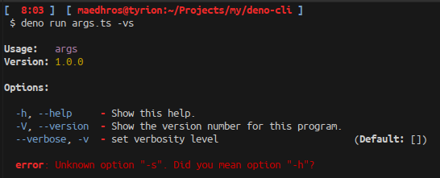
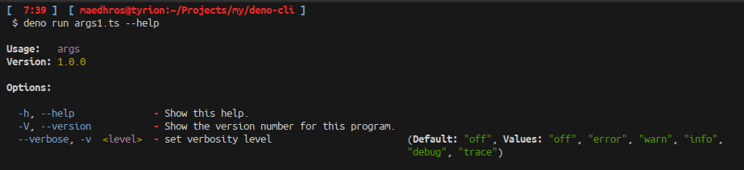
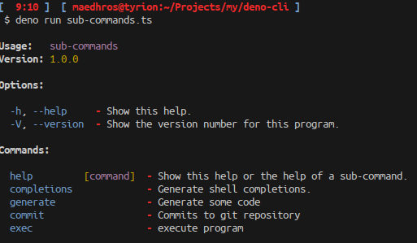
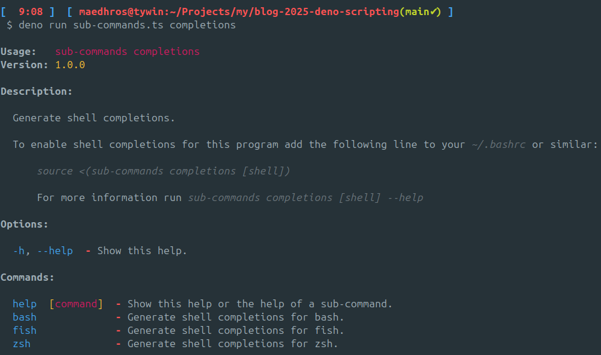
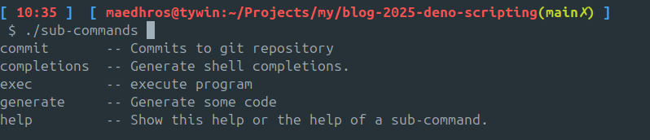

+++
date = '2025-02-13'
title = 'Deno scripting'
tags = ["deno", "script", "bash", "typescript"]
+++

## Introduction

Have you ever felt like you’re making too many shell scripts? Some may say that every line of `bash` is too much `bash`.
An example of why bash may be not the best solution for writing scripts is shellcheck. There are [too many possible mistakes](https://gist.github.com/eggplants/9fbe03453c3f3fd03295e88def6a1324).

In the last few years I have been experimenting with different scripting languages, and I think I have found a few good ones.

A non-exhaustive list is:
* [ammonite](https://ammonite.io/)
* [Scala cli scripts](https://scala-cli.virtuslab.org/docs/guides/scripting/scripts)
* [Deno](https://docs.deno.com)

You may notice that all of these are using strongly typed languages, and you may rightly ask why.
We have [type inference](https://en.wikipedia.org/wiki/Type_inference) in most strongly typed languages.
This means that we rarely have to declare the types, we can't all be Java.

In my experience, using strongly typed languages actually helps drive the scripts along.
Also since we have a _real_ programming language, we can create abstractions to help doing the correct things.
We can also test the code, since we have a built-in test-runner.

> [!NOTE]
> Technically you [can](https://github.com/bats-core/bats-core) do this in bash

My latest discovery is the typescript runtime [Deno](https://deno.com).
This post will explore a few ways of why you may want to use something like Deno for some of your scripting needs.

## Command line parsing
I am sure you have tried parsing [command line arguments](https://stackoverflow.com/questions/192249/how-do-i-parse-command-line-arguments-in-bash) in bash. This is surprisingly difficult and error prone.

How can we do this in deno? In short; we use [Cliffy](https://cliffy.io/).

First we need to add this dependency:

`deno add "jsr:@cliffy/command@^1.0.0-rc.7"`

> [!NOTE]
> Cliffy is only available as an RC at the time of writing.

Deno will now create two new files called `deno.json` and `deno.lock` in the working directory.


Create a new file called `args.ts` and paste the following code into your favourite $EDITOR.

```typescript
import { Command } from "@cliffy/command";

type Options = {
  verbose: unknown[];
};

await new Command()
  .name("args")
  .version("1.0.0")
  .option("--verbose, -v", "set verbosity level", { collect: true, default: [] })
  .action((opt: Options) => {
    const verboseLevel = opt.verbose.length;
    console.log("Verbosity level is", verboseLevel);
  })
  .parse(Deno.args);
```

Test it out by running it:

`deno run args.ts`

```bash
 Verbosity level is 0
```

`deno run args.ts -v`

```bash
 Verbosity level is 1
```

`deno run args.ts -vvv`

```bash
 Verbosity level is 3
```

### Error handling

Lets try running this with an incorrect option.

`deno run args.ts -vs`



This is a quite nice error message!

We can immediately see what we did wrong, and we get a nice help screen.


### But can we improve this?

We cannot say that the type `Options` has a lot of useful information, we are using an
`unknown` array here, which is not really anything useful. Let's refactor this a bit.
Let's call this new file `args1.ts`.

```typescript
import { Command, EnumType } from "@cliffy/command";

enum Level {
  off = "off",
  error = "error",
  warn = "warn",
  info = "info",
  debug = "debug",
  trace = "trace",
}

type Options = {
  verbose: Level;
};

await new Command()
  .name("args")
  .version("1.0.0")
  .type("level", new EnumType(Level))
  .option("--verbose, -v <level:level>", "set verbosity level", { default: Level.off })
  .action((opt: Options) => {
    const verboseLevel = opt.verbose;
    console.log("Verbosity level is", verboseLevel);
  }).parse(Deno.args);
```

Now we can immediately see an improvement in typesafety, and we get the possible levels available in the help output.
Let us test this out:

`deno run args1.ts --help`



### Reusable Commands
Expanding on the previous section, we can improve the usage of the command defined there.

Lets modify `args1.ts` into a new file `args2.ts`:

```typescript
import { Command, EnumType } from "@cliffy/command";

export enum Level {
  off = "off",
  error = "error",
  warn = "warn",
  info = "info",
  debug = "debug",
  trace = "trace",
}

export type Options = {
  verbose: Level;
};

export const args = new Command()
  .name("args")
  .version("1.0.0")
  .type("level", new EnumType(Level))
  .option("--verbose, -v <level:level>", "set verbosity level", { default: Level.off })
  .action((opt: Options) => {
    const verboseLevel = opt.verbose;
    console.log("Verbosity level is", verboseLevel);
  });

if (import.meta.main) {
  await args.parse(Deno.args);
}
```

We also now export the `Level`, `Options` and `args` members so we can use the command elsewhere.
Adding the `if (import.meta.main)` as guard, allows us to still run this as a main function.

## Subcommands

> [!INFO]
> This is a pattern in scripting to have multiple executable commands grouped together as a single command.

We create a new file called `sub-commands.ts`

```typescript
import { Command } from "@cliffy/command";
import { HelpCommand } from "@cliffy/command/help";
import { CompletionsCommand } from "@cliffy/command/completions";
import { args } from "./args2.ts";

const generate = new Command()
  .description("Generate some code")
  .action(() => {
    console.log("Would generate some code here");
  });

const commit = new Command()
  .description("Commits to git repository")
  .action(() => {
    console.log("Would commit to git repo here");
  });

const sub = new Command()
  .name("sub-commands")
  .version("1.0.0")
  .action(function () {
    this.showHelp();
  })
  .command("help", new HelpCommand().global())
  .command("completions", new CompletionsCommand())
  .command("generate", generate)
  .command("commit", commit)
  .command("exec", args.description("execute program"));

if (import.meta.main) {
  await sub.parse(Deno.args);
}
```

First we import two built-in commands that grants us shell completion and a help command.
Next we define two new commands, called `generate` and `commit`.

Lastly we compose these together to form a new program, combining it with the `const args` value we created in the previous section.

Running `deno run sub-commands.ts` with no arguments yields:




### Shell completion
To use the built-in shell completion in `cliffy` you have to first activate it.


> [!INFO]
> We need to run the script as a standalone command.
> The reason for this is that the completion system expects a `known` command
> Our name for the command is `sub-commands`

Here are two different ways we can do that:

1. Use a [shebang](https://en.wikipedia.org/wiki/Shebang_%28Unix%29)

Prepend `#!/usr/bin/env deno` to `sub-commands.ts` then rename it to `sub-commands`

We also need to make the new script executable
`chmod 755 sub-commands`

2. Compile the program into an [executable](https://docs.deno.com/runtime/reference/cli/compile/).

`deno compile sub-commands.ts`

This will produce a binary for the [current platform]()https://docs.deno.com/runtime/reference/cli/compile/#cross-compilation.
Another benefit from compilation is that we also solve the distrbution problem.

Next we need to load the completions into the current shell.

```zsh
source <(./sub-commands completions zsh)
```

Once this is loaded successfully we can <TAB> complete in:

```zsh
./sub-commands <tab>
```



## Run an executable (in Bash)

OK. Running a process in bash is really easy. We just do this:

```bash
local out=$(foo bar)
```

This will capture the output of `stdout` into the variable `out`.

### but what if it fails...

We might need to check the [exit code of the previously run command](https://csatlas.com/bash-last-exit-status/).

For bash you need to [deal](https://www.baeldung.com/linux/bash-script-raise-error) with [problem](https://gist.github.com/mohanpedala/1e2ff5661761d3abd0385e8223e16425) in a [intuitive](https://www.howtogeek.com/782514/how-to-use-set-and-pipefail-in-bash-scripts-on-linux/) way.

What happens to the output of [stderr](https://www.cyberciti.biz/faq/redirecting-stderr-to-stdout/)? Should that also be read into the variable?


## Run an executable (in Deno)

```typescript
const out = new Deno.Command("foo", {args: ["bar"]}).outputSync()
const td = new TextDecoder();
const stdout = td.decode(out.stdout).trim();
const stderr = td.decode(out.stderr).trim();
```
This is more code than the bash simple case, but we get a few benefits:

1. The command, and its scope is clear from the type Deno.Command
2. We can capture both the `stdout` and `stderr`
3. We can query the exit status by checking `out.success`

But this is not everything, we can redirect the output directly into the current process'
`stdout` or `stderr` as needed. We can pipe `stdout` into `stdin` in other commands, just like in bash.

Take a look at the [API](https://docs.deno.com/api/deno/~/Deno.Command) for more uses.


## Conclusion

I hope this post has inspired you to take a look at other languages for your scripting needs.
Deno has a lot going for it, and I think it is accessible for most people.
The code for this post is also available as a git repo [here](https://github.com/hamnis/blog-2025-deno-scripting)
